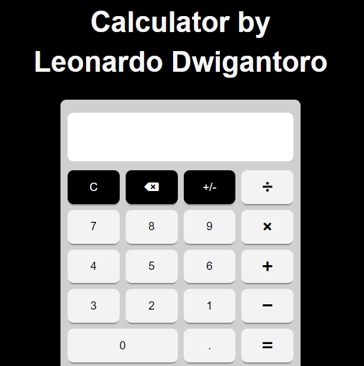

# Calculator
A simple calculator made with HMTL, CSS, & Vanila Javascript.

## Preview



## Installation

```bash
Download files and run index.html
```

## License
[MIT](https://choosealicense.com/licenses/mit/)